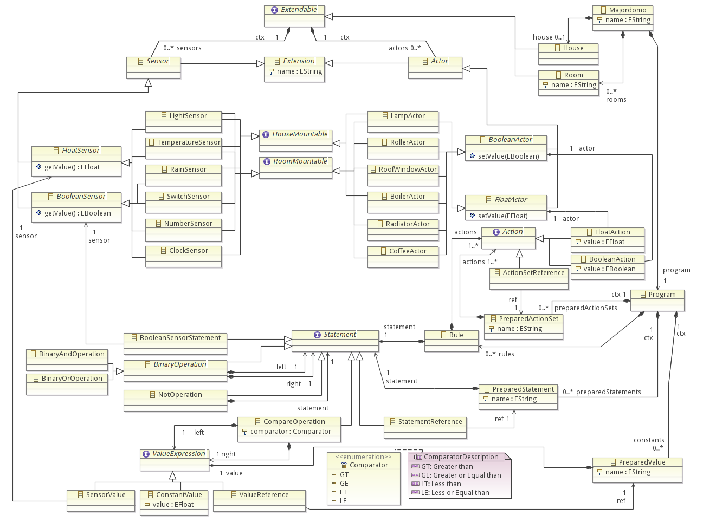

# Majordomo

Majordomo is an EMF/Xtext project for a home automation system DSL and a Xpand based simulation tool.

## Prerequisites

You will need the Eclipse IDE (recommended 4.2 Juno release) accompanied by the Modeling Components, Xtext, Xtend, Xpand and ATL.

## Install

After cloning this repository you should import all projects into your workspace. This will result in some errors because there are files missing. You need to generate that missing files:

- Open *de.altimos.mdsd.majordomo\model\majordomo.genmodel* and choose "Generate All" from root element's context menu.
- Execute the MWE2 Workflow file *GenerateMajordomoDSL.mwe2* located in *de.altimos.mdsd.majordomo.dsl\src\de\altimos\mdsd\majordomo\dsl\GenerateMajordomoDsl.mwe2*

Now you should be able to launch another Eclipse instance from your current instance providing you with a comfortable DSL editor. If you want to use the Majordomo Simulator you'll need to generate parts of it's code:

- Execute the MWE2 Workflow located in *de.altimos.mdsd.majordomo.codegen\src\workflow\GenerateMajordomoCode.mwe2*. It will use *de.altimos.mdsd.majordomo.codegen\src\model\musterhaus.domo* and generate a matching simulator program.
- Launch *de.altimos.mdsd.majordomo.simulator.MajordomoSimulator* as a standard Java application.

To use the ATL model transformation execute the ATL file *de.altimos.mdsd.majordomo.house2domo\house2domo.atl* and providing suitable source and targets
model files in the Run Configuration.

## Majordomo DSL

The file *de.altimos.mdsd.majordomo.codegen\src\model\musterhaus.domo* contains a full example on how to use the DSL.

The Majordomo DSL can be used to describe a home automation system containing sensors and actors and a set of rules how the are connected.

First you have to define your sensor and actor setup. Sensors and actors can be assigned to the house, like an outdoor light sensor, or to specific rooms:

```
house {
	@light light;
	@rain rain;

	@lamp lamps;
}

room kitchen {
	@temp temp;

	@coffee coffee;
}
```

Rooms must have an identifier that will be used when accessing sensors and actors from rules. Therefore sensor and actor names only need to be unique within a room or the house.

### Supported sensors

Currently the following sensors are supported:

* *LightSensor* (@light): The light sensor returns a light level between 0.0 and 1.0. The higher the value is the brighter it is.

* *TemperatureSensor* (@temp): The temperature sensor returns the current temperature as a float value in degrees Celsius.

* *RainSensor* (@rain): The rain sensor returns true if it's raining, false otherwise. The rain sensor can only be attached to a house.

* *SwitchSensor* (@switch): The switch sensor is a normal analogous switch that can be turned on or off. Switches cannot be assigned to the house.

* *NumberSensor* (@number): The number sensor represents a number pad to enter a value into the system like the desired room temperature. Numpads must be assigned to a room.

* *ClockSensor* (@clock): The clock sensor returns the current daytime (24h) as a float. Minutes are represented as fractions between .00 and .59. Only houses can be equipped with a clock. There is currently no support for different time flows due to quantum effects within the same building.

### Supported actors

The following actors are currently supported:

* *LampActor* (@lamp): The lamp actor accepts float values between 0.0 and 1.0. Zero means the lamp is off, higher values may be used to set a brightness. One is full power.

* *RollerActor* (@roller): Roller actors are controllable rollers at windows and can be toggled up or down.

* *RoofWindowActor* (@roof): The roof window actor represents an electrical root window that can be opened and closed.

* *BoilerActor* (@boiler): A boiler that can be turned on or off.

* *RadiatorActor* (@radiator): A heater that can be attached to a room. It can be switched on and off.

* *CoffeeActor* (@coffee): A coffee pot actor that can be switch on to make fresh coffee. Currently only one flavor of coffee is supported.

All sensor and actor semantics are described as interpreted by the simulation tool. Different code generation projects may specify different semantics.

### Rules

You can now start to specify rules. Rules consist of a conditional statement and a list of actions that should be triggered according to the given condition. A rule will only be triggered when the evaluated condition jumps from false to true. That means a rule like `on time >= 7.30 do kitchen.coffee: true` will only be triggered when the clock jumps from a value below `7.30` to `7:30` or higher. It will not be triggered if the clock changes from `8:00` to `8:01`.

This is necessary because sensors may jump when changing. A rule like `on light == 0.45 do lamps: false` may not be triggered when the light sensors jumps directly from `0.44` to `0.47`, so there isn't even a equal comparator.

See the following example on what is possible with rules:

```
program {
	on time >= 7.30 do boiler: true
	on light <= 0.5 and (time >= 23 or time <= 4.30) do lamps: 0.2

	on kitchen.temp > 19 and light > 0.6 do kitchen.rollers: true

	on rain? do kitchen.roofWindow: false
}
```

The first rule turns on the boiler at 7:30. The second rule dims the outdoor lamps between 23:00 and 4:30 if it's not to bright. The third rule toggles down the rollers in the kitchen if it's getting hot inside and the sun is shining outside (and heating up the room). The last rule closes the roof window if it's starting to rain outside. Note that the question mark is required when using a boolean sensor in a statement.

Also take a look at our [Musterhaus](de.altimos.mdsd.majordomo.codegen/src/model/musterhaus.domo).

## Advanced usage

You can store any part of a rule, may it be a conditional statement, a set of actions or only a values or sensor reference, in a predefined helper.

The following example stores the condition if it's dark outside in a helper function, stores a set of related actions to shut down the radiator and open a window in a predefined set. Also the threshold used to define if it's dark is stored in a predefined constant:

```
program {
	val LIGHT_THRESHOLD: 0.5

	def darkness: light <= LIGHT_THRESHOLD

	set openKitchenWindow: kitchen.radiator: false, kitchen.windows: true

	on darkness: lamps: 1.0
	on not darkness: lamps: 0.0

	on kitchen.temp > 21: openKitchenWindow, kitchen.coffee: false
}
```

Semicolons may be placed at the end of a statement but are not required.

As logical operations you can use `AND`, `OR` and `NOT`. For `AND` you can use the following operators: `and`, `&&`, `&`. OR: `or`, `||`, `|`. A negation statement can be created using the unary `not` or `!` operator. The expression syntax follows the standard logical operator precedence: `not > and > or`. You can use brackets to chain expressions.

### Meta Model



## License

Copyright (c) 2012-2013 Christian Nicolai, Jan Graichen

Licensed under EPL v1.0.

The Majordomo project was developed as part of the Model-driven Software Development seminar at the Hasso-Plattner Institute.
